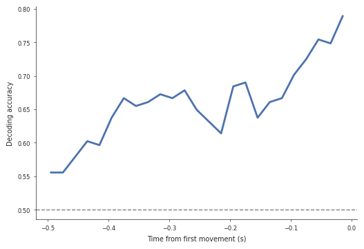
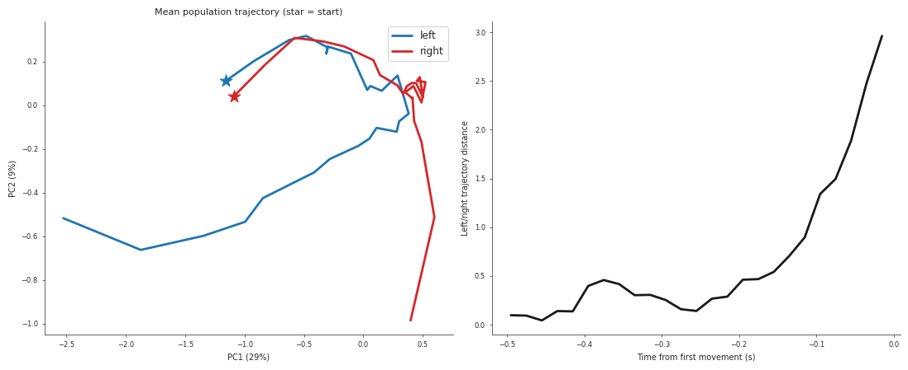
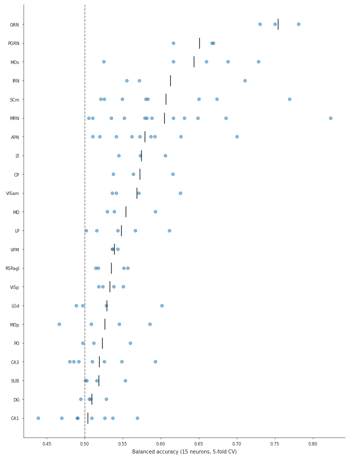

# Can you read a mouse's decision before it moves?

Decoding a mouse's upcoming left/right choice from Neuropixels population activity in the International Brain Laboratory (IBL) brain-wide map, and finding which brain regions carry that signal.

| | |
|---|---|
| **Data** | IBL brain-wide map, 82 probe insertions, 22 brain regions |
| **Models** | Logistic regression vs. PyTorch GRU |
| **Task** | Predict left vs. right choice from the 500 ms before first movement |
| **Metric** | Balanced accuracy, 5-fold stratified cross-validation |

## 1. Choice information builds up before the mouse moves

Using only activity up to time *t*, decoding accuracy rises from near chance to about 0.79 as the movement gets closer (one example session, single train/test split, so it is noisy).

  

The GRU's hidden states tell the same story. Mean left and right trajectories (PCA) start together and pull apart as movement onset approaches.

  

## 2. A GRU does not beat a linear decoder

Across six random sessions, both models land at about the same accuracy:

| Decoder | Mean balanced accuracy |
|---|---|
| Logistic regression | 0.599 |
| PyTorch GRU | 0.607 |

The spread across sessions (0.51 to 0.77) is much larger than the gap between models. With a few hundred trials per session, the extra capacity of the GRU has nothing to learn from.

## 3. Which regions carry choice information?

Each region's neurons were decoded on their own, with every region subsampled to 15 neurons (10 random draws per session) so that regions with more recorded neurons do not win by default. Each dot is a session; the black tick is the mean.

  

The top of the ranking is brainstem reticular nuclei (GRN, PGRN, IRN), secondary motor cortex (MOs), superior colliculus (SCm) and midbrain reticular nucleus (MRN), at roughly 0.60 to 0.75. Hippocampus (CA1, DG, CA3, SUB) and early visual areas stay near chance.

## Limitations

- The decoding window is the last 100 ms before first movement, so high accuracy in brainstem and motor regions largely reflects movement preparation, not decision making.
- Sessions from the same mouse are not independent.
- Regions with only 3 to 4 sessions (e.g. GRN) are suggestive, not established.
- The GRU adds nothing over a linear decoder here, which is expected with a few hundred trials per session.

## Run it

Open the notebook in Colab with the badge above. The first part is the Neuromatch Academy tutorial's setup and data loading (it installs `ONE-api` and `ibllib`). The analysis is in Part A (GRU vs. logistic regression) and Part B (regions).

Data: [International Brain Laboratory brain-wide map](https://www.internationalbrainlab.com/brainwide-map).
